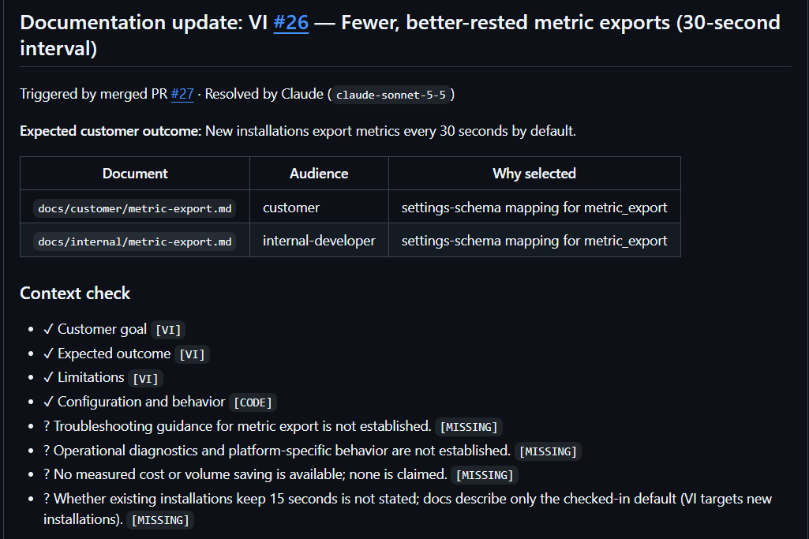
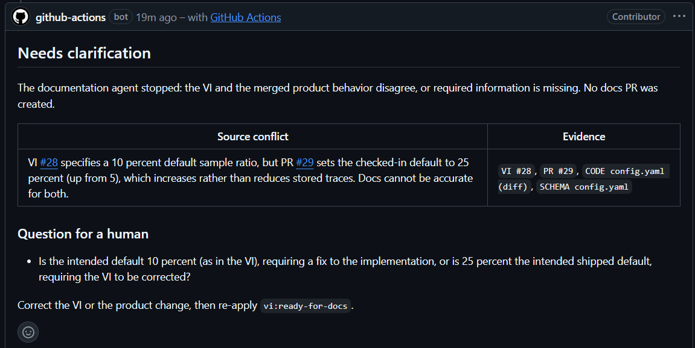
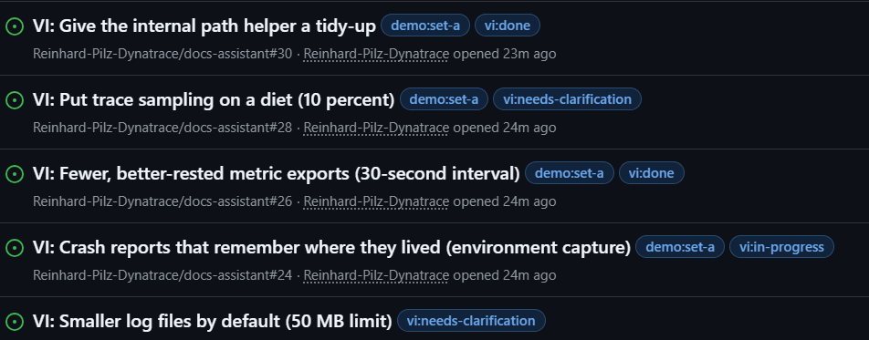
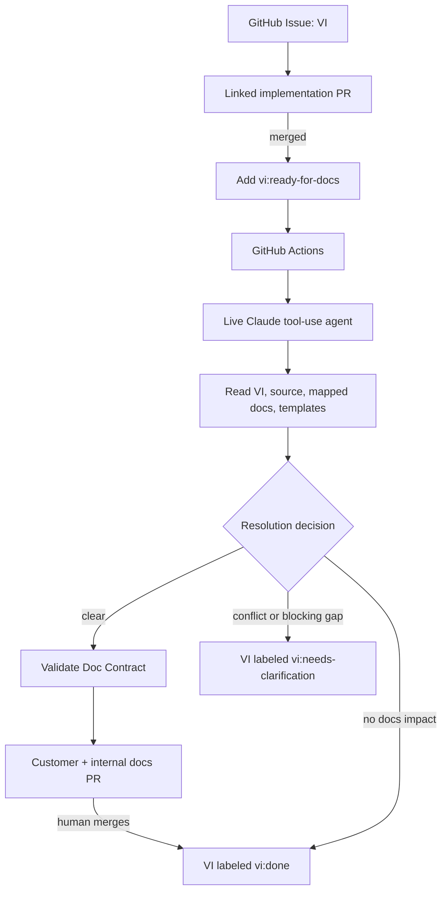

# Evidence-Grounded Documentation Automation

**Not an AI that writes documentation. A system that keeps product knowledge and documentation in sync, and says so when it can't.**

A hackathon prototype in Go. A live Claude agent reads a product ticket, the code change that implemented it, and the current documentation. It then does one of three things, and never anything else.

## The problem

Products change every week, and the documentation quietly goes stale. The obvious fix is to ask an AI to write the docs. That is risky, because a model will happily state things nobody can back up.

This project does the opposite. The agent may only write what it can point to evidence for. Where the sources disagree or information is missing, it stops and asks a person.

## What happens when a change is ready for docs

A developer merges a change. One person adds one label, `vi:ready-for-docs`, to the ticket that describes the change. From there the agent decides:

| Situation | What the agent does |
|---|---|
| The ticket, the merged code and the current docs agree | Opens a documentation pull request, with one page for customers and one for internal developers, for a person to review |
| The ticket contradicts the merged product | Stops, shows both sides, asks one question, and writes nothing |
| The change affects nothing anyone reads | Says so, and opens nothing |

One rule never bends: **the agent never merges documentation.** People do.

## See it

**A documentation pull request a reviewer can check in a minute.** Two documents, chosen for stated reasons; what is known, tagged by source (`VI` for the ticket, `CODE` for the product); and what is not known, listed as missing and not invented. The statement "none is claimed" is deliberate: no cost or performance saving was measured, so none is asserted.



**When the sources disagree, it stops.** The ticket asked for a 10 percent default and the merged code shipped 25. The agent did not pick a side or blend them. It showed both sources side by side and asked one question.



**Status lives on the ticket.** Each ticket carries exactly one workflow label, so the state of every change is visible at a glance.



These screenshots are from real runs of the live agent, recorded earlier. The text differs a little from run to run; the structure does not.

## How it works



- **The agent is boxed in.** It is a Claude model with three small tools: read the ticket and the change, read only the documentation and source files mapped to this feature, and submit a conclusion. It never sees the whole repository. A checked-in mapping (`mappings/docs-map.yaml`) decides which pages a change affects, and reports why.
- **The source of truth is the code.** The ticket provides intent and business context, not proof of what the product does. If they disagree, the agent must flag it and block, and a person decides.
- **The result is a Doc Contract.** This is a structured record of what the agent knows: the change, the ticket's context, the affected documents, each claim with its evidence, conflicts, and missing information. It is saved as a workflow artifact, together with the full tool trace, so the reasoning is inspectable.
- **Deterministic checks guard the output.** Plain Go code, not the model, verifies that every claim cites known evidence, that only mapped documents are touched, and that the required template headings are present.
- **Two audiences, kept apart.** Customer pages and internal developer pages follow different templates (`docs/templates/`). The agent is instructed not to put internal-only details into customer pages. That instruction is not yet enforced by code (see below).
- **Humans stay in the loop.** Documentation pull requests are reviewed and merged by people. If someone closes a ticket before the documentation gate is satisfied, the workflow reopens it with an explanation. GitHub cannot veto closing synchronously, so this is a visible guard, not a lock.

The workflow labels are mutually exclusive: `vi:in-progress`, `vi:ready-for-docs`, `vi:needs-clarification`, `vi:docs-review`, and `vi:done`. Adding `vi:ready-for-docs` triggers the agent, but only after the ticket names a merged implementation PR.

See [PROJECT.md](PROJECT.md) for the complete scope, scenarios and policy, and [PROGRESS.md](PROGRESS.md) for the current state.

## What has been verified, and what has not

**Verified with real runs** (live Claude through a gateway, real GitHub Actions, real pull requests): a feature whose default changes and whose docs follow; a documentation regression where the old docs disagree with new code; a blocked ticket where the ticket contradicts the code; a no-impact internal change that opens nothing; and automatic reopening of a ticket closed too early. The deterministic parts are covered by Go tests, which run in CI.

**Not claimed:**
- No speed, cost or quality-of-prose benchmarks were measured.
- The products in this repository are fictional, and the code is a minimal fixture. The idea applies to real tickets and repositories, but that has not been tried here.
- Keeping internal-only details out of customer pages is an instruction to the agent, not a code-enforced check.
- Documentation pull requests opened by the Actions bot do not trigger CI, so GitHub may show a check waiting for approval. The documentation is reviewed by a person either way.
- The agent's wording varies between runs.

## Questions you may have

**Why trust the model?** It is boxed in: bounded evidence, mandatory citations, deterministic checks on paths and headings, and a human merge.

**What if the ticket is wrong?** That is the blocked case. The code is the source of truth for what the product does, and a person decides which side to correct.

**Does it publish on its own?** Never. Documentation pull requests are merged by people.

**Is the demo scripted?** The inputs are fixed; the agent's output is live. See [DEMO.md](DEMO.md) for the runbook.

## Reproduce the demo

[DEMO.md](DEMO.md) is the presenter's runbook: timed scenes, the demo tickets (two independent sets of four, labeled `demo:set-a` and `demo:set-b`), a checklist, and fallbacks. Each ticket can be live-triggered once.

The short version:

1. Create a ticket with the **Value Increment** issue form: user goal, audience, outcome, limitations, documentation hints.
2. Create and merge an implementation PR, and put its number in the ticket's **Merged implementation PR** field.
3. Add `vi:ready-for-docs`. The Action calls Claude and uploads the Doc Contract and the tool trace.
4. Depending on the ticket, one of three outcomes follows: a docs PR and `vi:docs-review`, a question and `vi:needs-clarification`, or `vi:done` with no PR.
5. Review and merge the docs PR. Its merge marks the ticket `vi:done`. Documentation is never auto-merged.

The Action summary shows the Claude model, the decision, the affected documents and audiences, conflicts, missing information, a context-size estimate, and the tool calls. The uploaded `doc-contract-*.json` and `tool-trace-*.json` artifacts make the evidence path inspectable.

## Technical reference

### Requirements

- Go 1.26 or later
- GitHub CLI (`gh`) for local GitHub authentication
- A Claude API key, or a gateway token and base URL, and a supported model ID for live agent runs

The live agent is used for the demo. HTTP test servers and test doubles exist only in automated tests; they are never presented as model reasoning.

### Local checks

Run the deterministic tests:

```sh
go test ./...
```

For a live local run, authenticate with `gh auth login`, set `GITHUB_REPOSITORY=owner/name`, `ANTHROPIC_MODEL`, and either `ANTHROPIC_API_KEY` (direct API) or `ANTHROPIC_AUTH_TOKEN` with optional `ANTHROPIC_BASE_URL` (gateway) in your shell, then run:

```sh
go run ./cmd/docs-assistant --issue 123
```

The issue must already have `vi:ready-for-docs` and include the number of its merged implementation PR. Never put the Claude key in a file or commit it.

### GitHub setup

Create the workflow labels before using the issue form; the issue form starts new tickets with `vi:in-progress`:

```sh
for label in vi:in-progress vi:ready-for-docs vi:needs-clarification vi:docs-review vi:done; do
	gh label create "$label" --color 1d76db --description "VI documentation workflow state" --force
done
```

In repository settings, add the Actions secret `ANTHROPIC_AUTH_TOKEN` (or `ANTHROPIC_API_KEY` for the direct API; update the workflow `env` to match) and the repository variables `ANTHROPIC_BASE_URL` (gateway only) and `ANTHROPIC_MODEL` containing a model ID supported by your Claude account. Enable "Allow GitHub Actions to create and approve pull requests" so the agent can open documentation PRs. The workflow's `GITHUB_TOKEN` uses only `contents: write`, `issues: write`, and `pull-requests: write` to update labels, publish docs branches, and open review PRs.

### Fixtures

`mappings/docs-map.yaml` maps each feature's schema concepts to its `source` files (read as evidence) and its customer and internal docs. The repository contains nine fictional features, each with code, configuration, tests and a customer and internal page, plus unmapped helper packages (`text_util`, `path_util`, `time_util`) that stand in for internal changes with no documentation impact. Features are independent, so tickets for different features never cause merge conflicts. The code is fictional.
