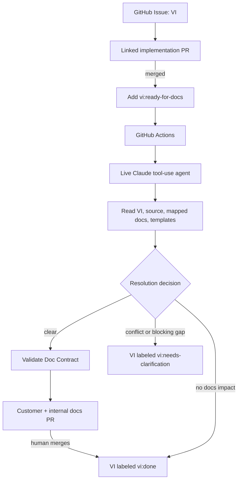

# Evidence-Grounded Documentation Automation

A Go hackathon demo in which a live Claude tool-using agent resolves a GitHub Issue representing a Value Increment (VI) into evidence-backed customer and internal developer documentation proposals.

The system does not ask an LLM to write docs from a broad prompt. It gathers the linked VI, merged implementation diff, checked-in source/configuration, mapped docs, and audience templates; Claude reasons over that bounded evidence and returns a Doc Contract. Deterministic checks validate citations, allowed document paths, and required headings before any documentation PR is opened.

See [PROJECT.md](PROJECT.md) for the complete scope, scenarios, policy, and implementation sequence.

## Workflow



The workflow labels are mutually exclusive: `vi:in-progress`, `vi:ready-for-docs`, `vi:needs-clarification`, `vi:docs-review`, and `vi:done`. Adding `vi:ready-for-docs` triggers the agent, but only after the issue names a merged implementation PR. A contradiction between the VI and product behavior blocks resolution. A stale existing doc can instead receive a proposed correction with the conflict preserved for review.

GitHub cannot synchronously veto issue closure. If a VI is closed before its docs gate is satisfied, the workflow reopens it with an explanation. This is a visible guard, not a permission lock.

## Requirements

- Go 1.26 or later
- GitHub CLI (`gh`) for local GitHub authentication
- A Claude API key and supported model ID for live agent runs

The final demo uses live Claude tool calls. HTTP test servers and test doubles are used only in automated tests; they are never presented as model reasoning.

## Local Checks

Run the deterministic tests:

```sh
go test ./...
```

For a live local run, authenticate with `gh auth login`, set `GITHUB_REPOSITORY=owner/name`, `ANTHROPIC_API_KEY`, and `ANTHROPIC_MODEL` in your shell, then run:

```sh
go run ./cmd/docs-assistant --issue 123
```

The issue must already have `vi:ready-for-docs` and include the number of its merged implementation PR. Never put the Claude key in a file or commit it.

## GitHub Setup

Create the workflow labels before using the issue form; the issue form starts new VIs with `vi:in-progress`:

```sh
for label in vi:in-progress vi:ready-for-docs vi:needs-clarification vi:docs-review vi:done; do
	gh label create "$label" --color 1d76db --description "VI documentation workflow state" --force
done
```

In repository settings, add the Actions secret `ANTHROPIC_API_KEY` and the repository variable `ANTHROPIC_MODEL` containing a model ID supported by your Claude account. The workflow's `GITHUB_TOKEN` uses only `contents: write`, `issues: write`, and `pull-requests: write` to update labels, publish docs branches, and open review PRs.

## Jury Demo

1. Create a VI with the **Value Increment** issue form. Describe the user goal, audience, outcome, limitations, and docs hints.
2. Create and merge an implementation PR linked to the VI. Put the merged PR number in the VI's **Merged implementation PR** field.
3. Add `vi:ready-for-docs` to the VI. The Action calls Claude and uploads a Doc Contract and detailed tool trace.
4. For the successful scenario, add `include_container_processes` and its tested behavior. Claude should propose separate customer and developer docs, validate both templates, and open a docs PR.
5. For the block scenario, make the VI claim a default or capability that contradicts merged product source. Claude should cite both sides, move the VI to `vi:needs-clarification`, and create no docs PR.
6. For the documentation-regression scenario, change `scan_interval_seconds` from 30 to 60 while existing docs still say 30. Claude should propose correcting both docs and keep the source/doc conflict visible in the PR report.
7. Review and merge the docs PR. Its merge marks the VI `vi:done`; docs are never auto-merged. Closing a VI before that gate completes causes the workflow to reopen it with an explanation.

The Action summary shows the actual Claude model, decision, affected docs and audiences, conflicts, missing information, context-size estimate, and tool calls. The uploaded `doc-contract-*.json` and `tool-trace-*.json` artifacts make the agent's evidence path inspectable.
